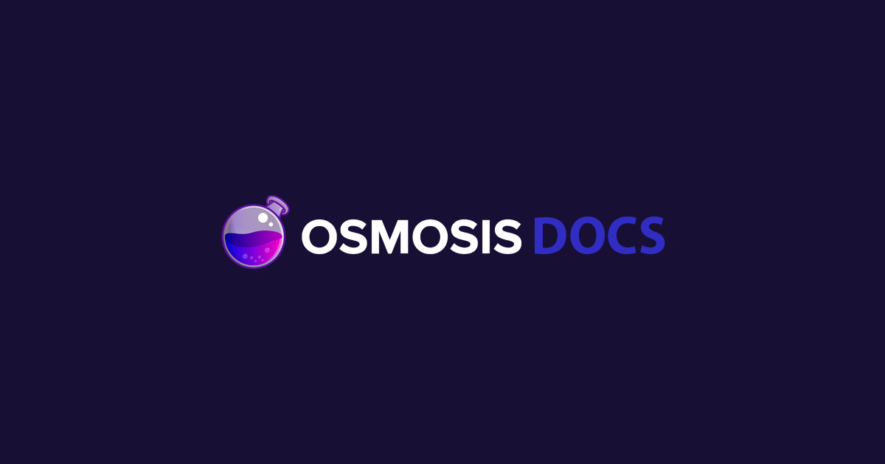

<!-- PROJECT LOGO -->
<p align="center">
  <a href="https://osmosis.zone">
    
  </a>

  <h2 align="center">Osmosis Docs</h2>

  <p align="center">
    Osmosis' documentation portal, built with Docusaurus.
    <br />
    <a href="https://docs.osmosis.zone"><strong>Explore the docs »</strong></a>
    <br />
    <br />
    <a href="https://github.com/osmosis-labs/docs/issues">Report Bug</a>
    ·
    <a href="https://github.com/osmosis-labs/docs/issues">Request Feature</a>
  </p>
</p>

<!-- TABLE OF CONTENTS -->

## Table of Contents

- [About the Project](#about-the-project)
  - [Built With](#built-with)
- [Getting Started](#getting-started)
  - [Prerequisites](#prerequisites)
  - [Installation](#installation)
- [Usage](#usage)
- [Contributing](#contributing)
- [Support](#support)
- [License](#license)

<!-- ABOUT THE PROJECT -->

## About The Project

[Docusaurus](https://docusaurus.io/) is a static site generator that helps you ship beautiful, accessible docs. For building our [documentation](https://docs.osmosis.zone) portal, we have made certain modifications over the template generated by [Docusaurus](https://docusaurus.io) to be able to properly showcase Osmosis-core, Cosmwasm and Javascript SDKs

### Built With

- [Docusaurus](https://docusaurus.io/)
- [React](https://reactjs.org/)
- [Tailwind](https://tailwindcss.com/)

<!-- GETTING STARTED -->

## Getting Started

This section describes how you can get our documentation portal up and running on your machine.

### Prerequisites

- [node](https://nodejs.org/en/)
- [npm](https://www.npmjs.com/)

### Installation

1. Clone the repo

```sh
git clone https://github.com/osmosis-labs/docs.git
```

2. Install NPM packages

```sh
npm install
```

3. Run the app

```sh
npm start
```

<!-- USAGE EXAMPLES -->

## Usage

<!-- In usage, mention how to edit the docs, how to update versions, etc. -->

### Writing Documentation

All documentation lives under [`docs/`](./docs), organized into the top-level sections `learn`, `integrate`, `build`, `validate`, and `community` (shared images live under `docs/assets/`). The site uses a single Docusaurus docs instance rooted at `docs/` and served at the site root, with one ordered sidebar; there is no per-section versioning. To edit a page, edit its Markdown/MDX file directly under the relevant section and run `npm start` to preview.

### To add a new page or section

Add the Markdown/MDX file under the appropriate `docs/<section>/` folder. New pages are picked up by the autogenerated sidebar in [`sidebars-default.js`](./sidebars-default.js); ordering within a section is controlled by `sidebar_position` frontmatter and `_category_.json` files. To surface a new top-level section in the navbar, add an entry to the `navbar.items` array in [`docusaurus.config.js`](./docusaurus.config.js).

### Adding a section to the Context Switcher

The in-sidebar section switcher is driven by the `SECTIONS` array in [`src/sections.js`](./src/sections.js). To add an entry, import an icon from [`src/icons`](./src/icons) and add an object to the array:

```jsx
import { MyIcon } from './icons';

const SECTIONS = [
  // ...
  {
    id: 'mysection',
    name: 'My Section',
    icon: MyIcon,
    section: false, // set true if it should show its own sections menu
  },
]
```

If you need a new icon, add it under `src/icons`.


<!-- CONTRIBUTING -->

## Contributing

Contributions are what make the open source community such an amazing place to be learn, inspire, and create. Any contributions you make are **greatly appreciated**. Sincere thanks to all our contributors. Thank you, [contributors](https://github.com/osmosis-labs/docs/graphs/contributors)!

## Support

Contributions, issues, and feature requests are welcome!
Give a ⭐️ if you like this project!

<!-- LICENSE -->

## License

Distributed under the Apache License, Version 2.0. See [`LICENSE`](./LICENSE) for more information.

<!-- MARKDOWN LINKS & IMAGES -->
<!-- https://www.markdownguide.org/basic-syntax/#reference-style-links -->
