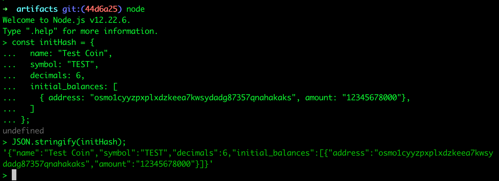

# Cosmwasm with LocalOsmosis
## Deploying Cosmwasm Contracts in LocalOsmosis

The following is a quick guide that shows the basics of deploying a contract to a Osmosis local environment. It covers: 

- Seting up LocalOsmosis with the Osmosis installer.
    - osmosisd binary automatically configured to connect to your localOsmosis
    - localOsmosis setup in yout $HOME directory (~/localosmosis)
- Deploy a smart contract
    - Download, compile, optimize 
    - Initialise, Instantiate, Query Contract
    
::: tip
Please note that Cosmwasm is permisionless by default. It's  permissioned in Osmosis mainnet. To learn more how to enable or disable permissioned Cosmwasm [click here ](https://github.com/CosmWasm/wasmd/blob/main/x/wasm/Governance.md)
:::


## Initial setup

This tutorial uses a Osmosis specific development tools to deploy contracts to your local Osmosis environment powered by localOsmosis.


### Set up Rust

Rust is the main programming language used for CosmWasm smart contracts. While WASM smart contracts can theoretically be written in any programming language, CosmWasm libraries and tooling work best with Rust.

First, install the latest version of [Rust](https://www.rust-lang.org/tools/install).  

Then run the following commands:

```sh
# 1. Set 'stable' as the default release channel:

rustup default stable

# 2. Add WASM as the compilation target:

rustup target add wasm32-unknown-unknown

# 3. Install the following packages to generate the contract:

cargo install cargo-generate --features vendored-openssl
cargo install cargo-run-script
```

### Setup  Localosmosis
The easiest way to setup your localOsmosis is by downloading the [automated installer](https://get.osmosis.zone/). You can learn more about localOsmosis by reading the [README](https://github.com/osmosis-labs/localosmosis) in the official repo. 

Run the following and choose option #3.
```
curl -sL https://get.osmosis.zone/install > i.py && python3 i.py
```
   


#### Start localOsmosis

Inside a separate bash window start your localOsmosis which was installed in ~/localosmosis

```
cd ~/localosmosis
docker-compose up

```
You will start seeing LocalOsmosis block activity in your terminal. Keep LocalOsmosis running while you perform the next steps in a new terminal window.


::: tip  
To view the LocalOsmosis wallet information, visit the [LocalOsmosis accounts page]([developing/tools/localosmosis.html#accounts](https://github.com/osmosis-labs/localosmosis#accounts)). 
:::

# Deploy a Smart Contract to Osmosis

## Download

```
# get the code
git clone https://github.com/CosmWasm/cosmwasm-examples
cd cosmwasm-examples
git fetch
cd contracts/erc20
```

## Compile

```
#compile the wasm contract
rustup default stable
cargo wasm
```

## Optimise it

```
sudo docker run --rm -v "$(pwd)":/code \
    --mount type=volume,source="$(basename "$(pwd)")_cache",target=/code/target \
    --mount type=volume,source=registry_cache,target=/usr/local/cargo/registry \
    cosmwasm/rust-optimizer:0.12.6
```

You now have a `cw_erc20.wasm` artifact inside the artifact directory. 

## Created a local key 
Create a key using one of the seeds provided in localOsmosis. 

```
osmosisd keys add <unsafe-test-key-name> --recover
```
Example test1 key from [here](https://github.com/osmosis-labs/localosmosis#accounts):

```
notice oak worry limit wrap speak medal online prefer cluster roof addict wrist behave treat actual wasp year salad speed social layer crew genius
```


## Deploy to your localOsmosis chain

```
cd artifacts
osmosisd tx wasm store cw_erc20.wasm  --from <unsafe-test-key-name> --chain-id=<chain-id> \
  --gas-prices 0.1uosmo --gas auto --gas-adjustment 1.3 -b block -y
```

`<unsafe-test-key-name>` = Name of your local key.
`<chain-id>` = localosmosis
    
### Save code_id
Save the code_id from the output of the command above.
    
or save it by running jq
    
```
cd artifacts
TX=$(osmosisd tx wasm store cw_erc20.wasm  --from <unsafe-test-key-name> --chain-id=localosmosis --gas-prices 0.1uosmo --gas auto --gas-adjustment 1.3 -b block --output json -y | jq -r '.txhash')
CODE_ID=$(osmosisd query tx $TX --output json | jq -r '.logs[0].events[-1].attributes[0].value')   
```

```
echo $CODE_ID 
```
If this is a brand new localOsmosis instante it should be `1`
    
    
# Initialise the Contract

## Generate JSON
Type node in the terminal and hit enter to access it. Copy and paste the following: 

```
const initHash = {
  name: "Test Coin",
  symbol: "TEST",
  decimals: 6,
  initial_balances: [
    { address: "<validator-self-delegate-address>", amount: "12345678000"},
  ]
};
```

`<validator-self-delegate-address>` = Choose the test1 address
    
Then copy and paste this: 
```
JSON.stringify(initHash);
```
The output should be something like:
    


## Instantiate the contract
 
```
osmosisd tx wasm instantiate $CODE_ID \
    '{"name":"Test Coin","symbol":"TEST","decimals":6,"initial_balances":[{"address":"<validator-self-delegate-address>","amount":"12345678000"}]}' \
    --amount 50000uosmo  --label "Testcoin erc20" --from <unsafe-test-key-name> --chain-id <chain-id> --gas-prices 0.1uosmo --gas auto --gas-adjustment 1.3 -b block -y
```
Replace
    - `<validator-self-delegate-address>` : wallet address
    - `<chain-id>` : localosmosis
    - `<unsafe-test-key-name>` : Local  key name
    
### Lookup contract address

```
CONTRACT_ADDR=$(osmosisd query wasm list-contract-by-code $CODE_ID --output json | jq -r '.contracts[0]')
```
### Query contract
    
```
osmosisd query wasm contract $CONTRACT_ADDR
```

### List all contracts

```
osmosisd query wasm list-code
```
    
::: warning
This guide will be updated and published to the official docs soon. 
To learn more about CosmWasm visit [https://cosmwasm.com/](https://cosmwasm.com/)
 :::  

