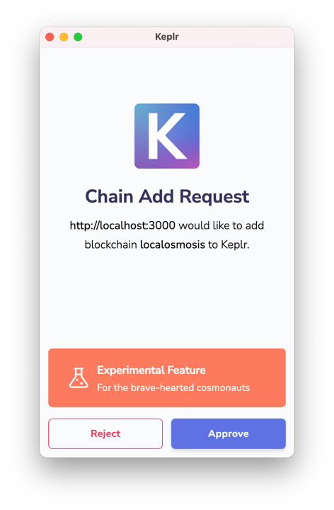

# Quick Guide


## Quickstart guide

Membrane is a Osmosis development environment for smart contracts.

This guide will walk you through setting up your environment, installing Membrane, and using the testnet or [LocalOsmosis](/developing/tools/localosmosis.html) to interact with a network.

For more information on Membrane, visit [Membrane's docs](/developing/tools/membrane.html).


# Initial setup

This tutorial uses a Osmosis specific development suite called Membrane.

Membrane will help you:

* Scaffold your dApp project
* Develop and deploy smart contracts
* Create custom tasks for blockchain and contract interaction
* Access a console (or REPL) for interacting with the Osmosis blockchain
* Create predefined functions used in tasks and in the console

## Prerequisites

- [Install Docker](https://www.docker.com/)
- [Install `docker-compose`](https://github.com/docker/compose)
- [Install NPM](https://www.npmjs.com/)
- [Install Node JS v16](https://nodejs.org/download/release/latest-v16.x/)

## 1. Set up Rust

Rust is the main programming language used for CosmWasm smart contracts. While WASM smart contracts can theoretically be written in any programming language, CosmWasm libraries and tooling work best with Rust.

First, install the latest version of [Rust](https://www.rust-lang.org/tools/install).  

Then run the following commands:

```sh
# 1. Set 'stable' as the default release channel:

rustup default stable

# 2. Add WASM as the compilation target:

rustup target add wasm32-unknown-unknown

# 3. Install the following packages to generate the contract:

cargo install cargo-generate --features vendored-openssl
cargo install cargo-run-script
```

## 2. Install Membrane

Use npm to install the Membrane command-line tool globally:

```sh
npm install -g @osmosis-labs/membrane
```

 
### LocalOsmosis vs Testnet

Depending on your setup, you can either install LocalOsmosis or use the Osmosis testnet to power Membrane. 

LocalOsmosis is a development environment designed to make it easy for smart contract developers to test their contracts locally. Membrane can also interact with the Osmosis blockchain's live testing environment using the Osmosis testnet. 

::: warning
LocalOsmosis may not work properly on machines with less than 16 GB of RAM. Please use the [Osmosis testnet](/developing/network/join-testnet.html) if your device does not meet this requirement.
:::

## Membrane with LocalOsmosis

### Use Membrane with LocalOsmosis

LocalOsmosis is a complete Osmosis testnet and ecosystem containerized with Docker. Use LocalOsmosis to simulate transactions in a test environment.

#### Prerequisites

- [Docker](https://www.docker.com/)
- [`docker-compose`](https://github.com/docker/compose)
- At least 16 GB of RAM
- [Keplr Wallet extension](https://chrome.google.com/webstore/detail/keplr/dmkamcknogkgcdfhhbddcghachkejeap?hl=en)
- Node.js version 16

::: warning
Use LTS Node.js 16 if you encounter the following error code:  
`error:0308010C:digital envelope routines::unsupported`
:::


::: details Running NPM on M1 Macs

Some M1 macs may need to use the latest LTS version of Node to complete this tutorial. Consider using a node version manager such as [NVM](https://github.com/nvm-sh/nvm/blob/master/README.md). 
After installing NVM, run the following to install and use the latest LTS version of node:

```sh
nvm install --lts
nvm use --lts
```

The `nvm use --lts` command will need to be run every time you open a new terminal to use the LTS version of node. 

To default to the LTS version of node when restarting your terminal, run the following:

```sh
nvm alias default <INSERT NODE VERSION HERE>
```
:::

### Install and run LocalOsmosis 

There are two ways to install localOsmosis. 

#### Manual download 
 - Download LocalOsmosis, run the following commands:

   ```sh
   cd ~/
   git clone --depth 1 https://github.com/osmosis-labs/localosmosis
   ```
   
#### Or Automatic download with Osmosis daemon configuration.
 - Uses the installer to configure the `osmosisd` daemon and automatically download localOsmosis

   ```sh
   curl -sL https://get.osmosis.zone/install > i.py && python3 i.py
   ```
- Select option (3) and follow the prompts. 
   

#### Start LocalOsmosis by running the following:

   ```sh
   cd ~/localOsmosis
   docker-compose up
   ```

You will start seeing LocalOsmosis block activity in your terminal. Keep LocalOsmosis running while you perform the next steps in a new terminal window.


::: tip 
LocalOsmosis Accounts
To view the LocalOsmosis wallet information, visit the [LocalOsmosis accounts page](developing/tools/localosmosis.html#accounts). 
For more configuration options, visit the [LocalOsmosis configuration page](/developing/tools/localosmosis.html#what-is-localosmosisd). 
:::

### Configure Keplr with localOsmosis

We added a small utility inside of localOsmosis to add your local chain to Keplr.

Inside your localOsmosis repo run the following:

```
cd localKeplr
npm start
```

Open your browser at [http://localhost:3000](http://localhost:3000) and allow it to add localOsmosis to your Keplr.



### Load accounts from localOsmosis to Keplr

LocalOsmosis provides a series of accounts in the genesis by defaults. [The seeds are available here](/developing/tools/localosmosis.html#accounts).

Open your keplr wallet extension and import the account with one of the seeds provided. You should now see balance in your Keplr wallet. 


::: warning 
The following sections are WIP. Just place holders. 
:::

## Membrane with the testnet

WIP

### Sample App tutorial 


#### 1. Scaffold your dApp


#### Project structure

The following structure shows your scaffolded project:

```
.
├── example              # example
│   ├── example
│   └── ...              # example
```

#### 2. Deploy

To deploy the application, run the following command:

```sh
placeholder
```

#### 3. Interact with the deployed contract


#### 4. Front-end scaffolding

Membrane also scaffolds a very simple front-end:

:::: warning
WIP, this integration with Keplr will need some work.
::::

1. Open the [Osmosis Keplr extension](https://chrome.google.com/webstore/detail/keplr/dmkamcknogkgcdfhhbddcghachkejeap?hl=en), click the gear icon, and switch the network to LocalOsmosis. If you have not added localOsmosis to your keplr yet, follow the instrcutions [here](#configure-keplr-with-localosmosis)

2. To use the front end, run the following commands in order. The `membrane sync-refs` command copies your deployed contract addresses to the front-end part of the codebase.

   ```
   membrane sync-refs
   cd frontend
   npm install
   npm start
   ```

3. Open the Keplr wallet extension and click **Add a wallet**. Click **Recover wallet** and input the following seed phrase to access the sole validator on the LocalOsmosis network and gain funds to get started with smart contracts:

   ```
   satisfy adjust timber high purchase tuition stool faith fine install that you unaware feed domain license impose boss human eager hat rent enjoy dawn
   ```

4. With LocalOsmosis selected in Osmosis Station and the local seed phrase imported, you can now increment and reset the counter from the front end.

#### Demo

:::: warning
WIP, this demo needs work.
::::

