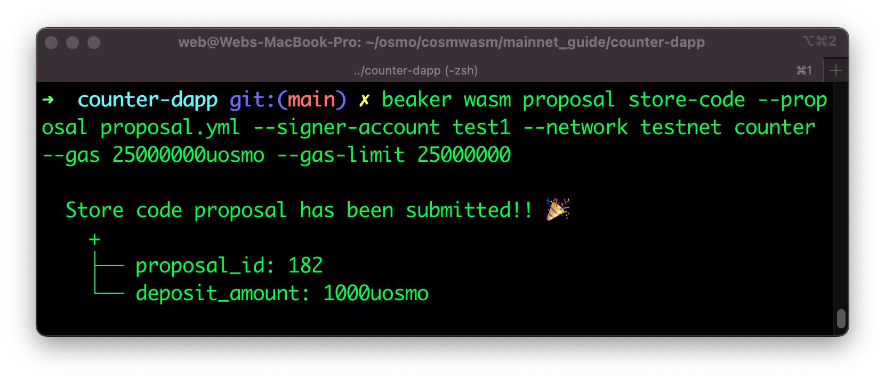

# Cosmwasm & Beaker
## Deploying Cosmwasm Contracts to the testnet with Beaker

The following guide will show you how to create and deploy a Cosmwasm smart contract to the Osmosis testnet. The testnet is permisonless by default to allow developers to test their contracts on a live environment. The Osmosis mainnet is permissioned meaning that you will need to submit a governance proposal in order to deploy to it. 

### Requirements
- [Rust](https://www.rust-lang.org/tools/install)
- [Cargo](https://doc.rust-lang.org/cargo/getting-started/installation.html) 

### Install Beaker

Beaker is available via [cargo](https://doc.rust-lang.org/cargo/getting-started/installation.html) which is a rust toolchain. Once cargo is ready on your machine, run:


```sh
cargo install beaker
```

### Scaffolding your new dapp project

In the directory you want your project to reside, run:

```sh
beaker new counter-dapp
```

For detailed information about Beaker [click here](https://github.com/osmosis-labs/beaker/edit/main/README.md).

### Your first CosmWasm contract with Beaker

After that we can create new contract (the command uses template from [cw-template](https://github.com/InterWasm/cw-template))

```sh
cd counter-dapp
beaker wasm new counter
```

### Deploy contract on permisionless network
The testnet is permisionless by default in order to allow developers to easily deploy contracts. 

```sh
beaker wasm deploy counter --signer-account test1 --network testnet --no-wasm-opt --raw '{ "count": 0 }' --label 'My first Beaker Contract'
```

Note how we added `--network testnet` to tell beaker to deploy to the testnet Osmosis chain. 

### Deploy with an admin
In this example we are using `osmo1nyphwl8p5yx6fxzevjwqunsfqpcxukmtk8t60m` which is the address from the beaker test1 account as seen in the [config.rs](https://github.com/osmosis-labs/beaker/blob/main/packages/cli/src/framework/config.rs) file. 

:::warning
Please note that account test1 is publicly available as documented [here](https://github.com/osmosis-labs/beaker/blob/main/docs/config/global.md) and only used for development purposes. Beaker will support local keyring in about 1-2 weeks. 
:::

```
beaker wasm deploy counter --signer-account test1 --admin osmo1nyphwl8p5yx6fxzevjwqunsfqpcxukmtk8t60m --network testnet --no-wasm-opt --raw '{ "count": 0 }' --label 'My first Beaker Contract' 
```
  


### Deploy contract via governance
We can also deploy the contract via governance on the testnet before going to mainnet. There are a couple of steps as described in the manual process via CLI[here](../local/submit-wasm-proposal.md), more details also available on the [official CosmWasm Docs](https://github.com/CosmWasm/wasmd/blob/main/x/wasm/Governance.md). 


### Build contract
This is required to create the compiled.wasm file that will be uploaded to the block chain.

```
beaker wasm build
```


### Submit proposal

The proposal can be submitted with all the meta data in a yml file or toml file. Example file:

```
touch prop.yml
nano prop.yml
```
Paste the following template

```yml
title: Proposal to allow DappName to be enabled in Osmosis
description: |
            A lengthy proposal description
            goes here  
            we expect this to be many lines...
deposit: 500000000uosmo
code:
    repo:   https://github.com/osmosis-labs/beaker/
    rust_flags: -C link-arg=-s
    roptimizer: workspace-optimizer:0.12.6
```

```sh
beaker wasm proposal store-code --proposal prop.yml --signer-account test1 --network testnet counter --gas 25000000uosmo --gas-limit 25000000
```
  


### Query proposal

There are four ways to query the proposal results

1. Beaker command
```
beaker wasm proposal query store-code --network testnet counter
```

2. Osmosisd 
```
osmosisd query gov tally 196
```

2. Mintstan testnet explorer
```
https://testnet.mintscan.io/osmosis-testnet/proposals/196
```

3. LCD Proposal endpoint

```
https://lcd-test.osmosis.zone/cosmos/gov/v1beta1/proposals/196
```

Note how the min_deposit was `500000000uosmo` that's why our prop.yml had `500000000uosmo`. If the deposit requirement is not met, then additional funds need to be send to the proposal. 

#### Proposal period 
On the testnet the voting period is very short to allow developers to move quickly with their testing, as you can see in this case it's `3 minutes`. This means you must vote within the next 3 minutes for your proposal to pass. In mainet the voting period is usually several days. If you take longer than 3 minutes, then you will get an error letting you know that the voting period has passed. 

```
    ├── voting_start_time: 2022-07-06T18:45:06Z
    └── voting_end_time: 2022-07-06T18:48:06Z
```

  


## Voting on proposal on testnet

Run the following command to vote from beaker

```
beaker wasm proposal vote --option yes counter --signer-account test1 --network testnet
```

Even though the testnet is configured as permisionless, it's important to understanding the voting process. We need validators to vote  for your proposal in order to reach the quorum. We created a simple utility in our faucet that will allow you to request a validator with enough voting power to vote for your proposal as well. 

Please visit: 

[https://faucet.osmosis.zone/#/contracts](https://faucet.osmosis.zone/#/contracts)

 

Great! Your proposal should have passed now!


### Signers

In the examples above we used the test1 account to sign transactions. However, Bekaer supports 3 options for signing transactions as shown on the official [README](https://github.com/osmosis-labs/beaker#Signers).

- `--signer-account` input of this option refer to the accounts defined in the [config file](../../beaker/config/global), which is not encrypted, so it should be used only for testing
- `--signer-mnemonic` input of this option is the raw mnemonic string to construct a signer
- `--signer-private-key` input of this option is the same as `--signer-mnemonic` except it expects base64 encoded private key
- `--signer-keyring` use the OS secure store as backend to securely store your key. To manage them, you can find more information [here](../../beaker/commands/beaker_key).

### Using the OS keyring
Let's dive a little deeper on how to use the OS keyring in order to sing a transaction with your OS keyring. 

First of all you can import an account by running:

```
beaker key set account1 'MNEMONIC'
```
or

```
beaker key set account1 'cable often loyal ozone master disorder gospel brief pool stairs lion sport urge copy myth exit toddler urban what live column deal vehicle hip'
```


Please note that Beaker currently supports 24 words mnemonics only. [ 12 will be supported](https://github.com/osmosis-labs/beaker/issues/88). 

This created a new account called `account1`. On Macs you are able to see this account in the keychain under the name of `beaker`

This document is constantly being updated and improved, please let us know on Github if you have any questions!
