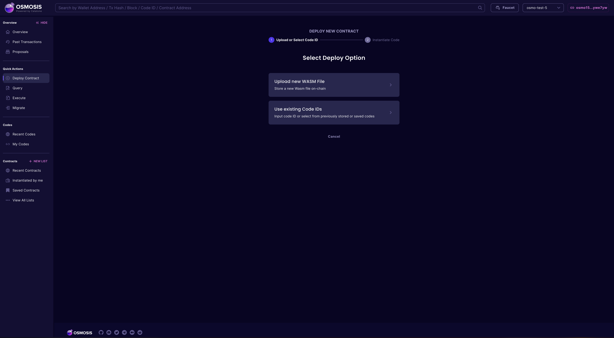
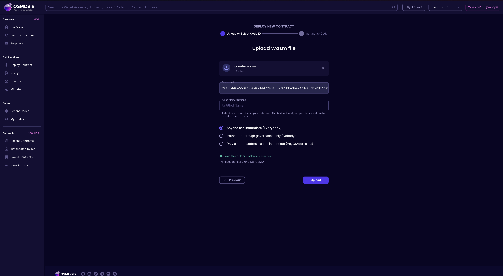
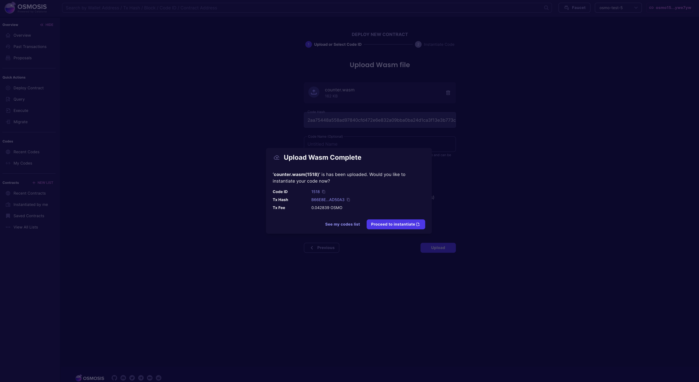
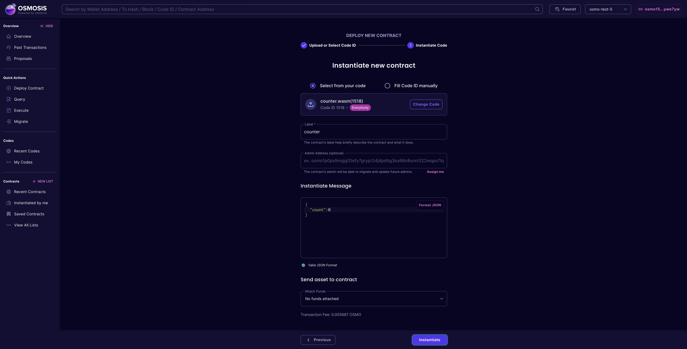
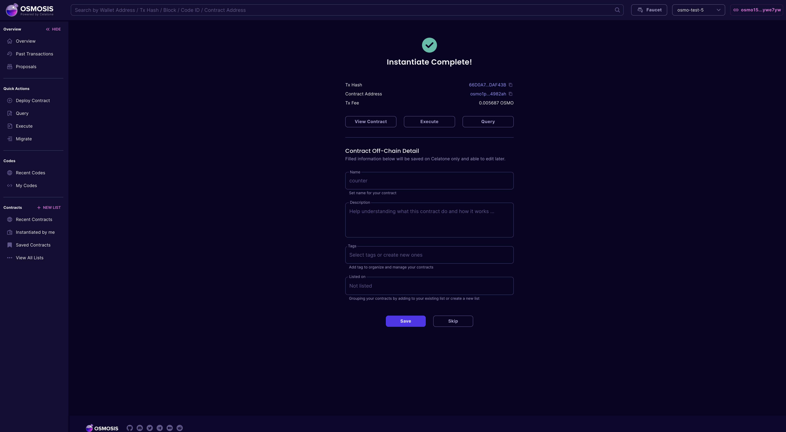

The following guide will walk you through the process of uploading and deploying a CosmWasm contract to the Osmosis testnet. The testnet is permissionless by default to allow developers to test their contracts on a live environment. The Osmosis mainnet is permissioned meaning that you will need to submit a governance proposal in order to deploy to it.

## Scaffolding the Project

Requirements

- [Rust](https://www.rust-lang.org/tools/install)
- [Cargo](https://doc.rust-lang.org/cargo/getting-started/installation.html) 

### Install Beaker

Beaker is available via [cargo](https://doc.rust-lang.org/cargo/getting-started/installation.html) which is a rust toolchain. Once cargo is ready on your machine, run:


```sh
cargo install beaker
```

### Scaffolding your new dapp project

In the directory you want your project to reside, run:

```sh
beaker new counter-dapp
```

For detailed information about Beaker [click here](https://github.com/osmosis-labs/beaker/edit/main/README.md).

### Your first CosmWasm contract with Beaker

After that we can create new contract (the command uses template from [cw-template](https://github.com/InterWasm/cw-template))

```sh
cd counter-dapp
beaker wasm new counter
```

For detailed information about Beaker [click here](https://github.com/osmosis-labs/beaker/edit/main/README.md).

### Compiling the Contract

To deploy the contract, we first need to compile it

```sh
beaker wasm build
```

Once the build is complete, the contract's wasm file will be created in the `artifacts` folder.

### Uploading the Contract

#### Testnet (Permissionless)

To upload the contract, navigate to [https://celatone.osmosis.zone](https://celatone.osmosis.zone) and select **Osmosis Testnet** from the network list on top right hand corner.

For permisisonless networks like the Osmosis testnet, click on **Deploy Contract** on the sidebar.



Click on "Upload new WASM File" and choose the previously built WASM file. Select the desired upload permission from the option.



Finally, click **Upload** and sign the transaction with your wallet. Once the transaction is commited, you should see a modal confirming the upload, as well as additional information such as the uploaded code's ID.



### Instantiating the Contract

Once you've uplaoded the contract, you can proceed to instantiate it. 

If you follow the steps from the previous section, you should see be able to select **Proceed to Instantiate**. This will take you to Celatone's Instantiate page, with the code ID already filled in. Otherwise, you can select a code to instantiate from from either the list of codes your wallet account has previously uploaded (**Select from your code**) or any other one (**Fill Code ID manually**).



After the code ID is selected, enter the contract's label, admin address (optional), and the instantiate message JSON. Finally, click **Instantiate** and sign the transaction with your wallet. Once the transaction is confirmed, you should see details about your instantiated contract including contract's address and the instantiate transaction hash.


