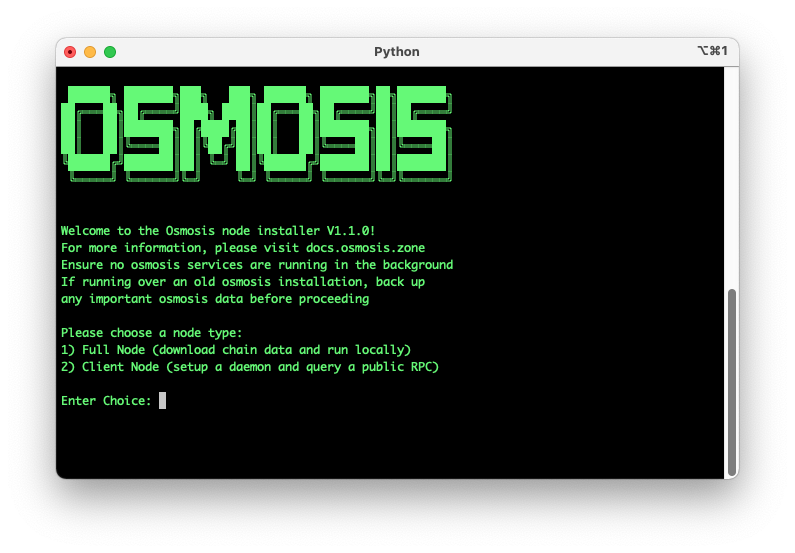

# Osmosisd

## Minimum Requirements

The minimum recommended specs for running osmosisd is as follows:
- 8-core (4 physical core), x86_64 architecture processor
- 32 GB RAM (or equivalent swap file set up)
- 1 TB of storage space

You can check if you have enough storage to run osmosisd [here](https://quicksync.io/networks/osmosis.html).

## Command Help
Go to [commands](#commands) to learn more.

## Quick Start

Go to [https://get.osmosis.zone/](https://get.osmosis.zone/) or copy and paste the following into your terminal, then follow the onscreen instructions:

```
curl -sL https://get.osmosis.zone/install > i.py && python3 i.py
```



If you are running on an Apple M1 Chip and are running into issues with osmosisd not being a recognized command: 

```
git clone https://github.com/osmosis-labs/osmosis.git
cd osmosis
make build
sudo cp build/osmosisd /usr/local/bin
```

## Manual Installation
### Update System

This guide will explain how to install the osmosisd binary onto your system.


On Ubuntu, start by updating your system:
```bash
sudo apt update
```
```bash
sudo apt upgrade --yes
```

## Install Build Requirements

Install make and gcc.
```bash
sudo apt install git build-essential ufw curl jq snapd --yes
```

Install go:

```bash
wget -q -O - https://git.io/vQhTU | bash -s -- --version 1.19.9
```

After installed, open new terminal to properly load go

## Install Osmosis Binary

Clone the osmosis repo, checkout and install v11.0.1:


```bash
cd $HOME
git clone https://github.com/osmosis-labs/osmosis
cd osmosis

git checkout v11.0.1

make install
```
:::tip Note
If you came from the testnet node instruction, [click here to return](../overview/validate)

If you came from the mainnet node instruction, [click here to return](../overview/validate)
:::


## Commands

This section describes the commands available from `osmosisd`, the command line interface that connects a running `osmosisd` process.

### `add-genesis-account`

Adds a genesis account to `genesis.json`.

**Syntax**
```bash
osmosisd add-genesis-account <address-or-key-name> '<amount><coin-denominator>,<amount><coin-denominator>'
```

**Example**
```bash
osmosisd add-genesis-account acc1 '200000000uOsmo,550000ukrw'
```

### `collect-gentxs`

Collects genesis transactions and outputs them to `genesis.json`.

**Syntax**
```bash
osmosisd collect-gentxs
```

### `debug`

Helps debug the application. 

### `export`

Exports the state to JSON.

**Syntax**
```bash
osmosisd export
```

### `gentx`

Adds a genesis transaction to `genesis.json`.

**Syntax**
```bash
osmosisd gentx <key-name> <amount><coin-denominator>
```

**Example**
```bash
osmosisd gentx myKey 1000000uOsmo --home=/path/to/home/dir --keyring-backend=os --chain-id=test-chain-1 \
    --moniker="myValidator" \
    --commission-max-change-rate=0.01 \
    --commission-max-rate=1.0 \
    --commission-rate=0.07 \
    --details="..." \
    --security-contact="..." \
    --website="..."
```

### `help`

Shows help information.

**Syntax**
```bash
osmosisd help
```

### `init`

Initializes the configuration files for a validator and a node.

**Syntax**
```bash
osmosisd init <moniker>
```

**Example**
```bash
osmosisd init myNode
```

### `keys`

Manages Keyring commands. 


### `migrate`
Migrates the source genesis into the target version and prints to STDOUT.

**Syntax**
```bash
osmosisd migrate <path-to-genesis-file>
```

**Example**
```bash
osmosisd migrate /genesis.json --chain-id=testnet --genesis-time=2020-04-19T17:00:00Z --initial-height=4000
```

### `query`

Manages queries. 

### `rosetta`

Creates a Rosetta server.

**Syntax**
```bash
osmosisd rosetta
```

### `start`

Runs the full node application with Tendermint in or out of process. By default, the application runs with Tendermint in process.

**Syntax**
```bash
osmosisd start
```

### `status`

Displays the status of a remote node.

**Syntax**
```bash
osmosisd status
```

### `tendermint`

Manages the Tendermint protocol. 

### `testnet`

Creates a testnet with the specified number of directories and populates each directory with the necessary files.

**Syntax**
```bash
osmosisd testnet
```

**Example**
```bash
osmosisd testnet --v 6 --output-dir ./output --starting-ip-address 192.168.10.2
```

### `tx`

Retrieves a transaction by its hash, account sequence, or signature. 

**Syntax to query by hash**
```bash
osmosisd query tx <hash>
```

**Syntax to query by account sequence**
```bash
osmosisd query tx --type=acc_seq <address>:<sequence>
```

**Syntax to query by signature**
```bash
osmosisd query tx --type=signature <sig1_base64,sig2_base64...>
```

### `txs`

Retrieves transactions that match the specified events where results are paginated.

**Syntax**
```bash
osmosisd query txs --events '<event>' --page <page-number> --limit <number-of-results>
```

**Example**
```bash
osmosisd query txs --events 'message.sender=cosmos1...&message.action=withdraw_delegator_reward' --page 1 --limit 30
```

### `unsafe-reset-all`

Resets the blockchain database, removes address book files, and resets `data/priv_validator_state.json` to the genesis state.

**Syntax**
```bash
osmosisd unsafe-reset-all
```

### `validate-genesis`

Validates the genesis file at the default location or at the location specified.

**Syntax**
```bash
osmosisd validate-genesis </path-to-file>
```

**Example**
```bash
osmosisd validate-genesis </genesis.json>
```

### `version`

Returns the version of Osmosis you're running.

**Syntax**
```bash
osmosisd version
```
