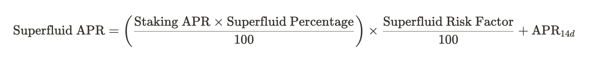

# APR Calculation

## Introduction
APR for each pools is a metric that indicates the expected annualized return on investment for liquidity providers. APRs are calculated differently for CL pools and normal pools due to their distinct operational mechanisms.

## Concentrated Liquidity Pools

### Calculation:
- **APR for CL Pools**: 

Where:
- **Spread Reward per Unit Liquidity**: This is the reward earned from the spread for providing liquidity, expressed per unit.
- **Incentive Reward per Unit Liquidity**: This is any additional incentive reward for providing liquidity, also expressed per unit.
- **Base Price**: The standardized value of one unit of liquidity in the pool, used to convert the reward values into a comparable base.
- **Seconds in a Year**: Represents the total number of seconds in a year, used for annualizing the return. It's calculated as \( 365.25 \times 24 \times 60 \times 60 \) to account for leap years.
- **Calculation Time Duration**: The duration in seconds over which the rewards were calculated 

## CFMM Liquidity Pools(Balancer pools, Stableswap Pools)

1. **Standard APR Calculation** (for 1 day, 7 days, and 14 days):
   - The APR is calculated for each time frame using the formula:
     
   - Where:
     - `Distribured Amount_timeframe` is the sum of distributed rewards for the time frame (1 day, 7 days, or 14 days).
     - `Exponent` is a factor related to the coin denomination.
     - `Liquidity` is the total liquidity in USD for the pool, adjusted by the percentage bonded (if applicable).
     - `Coin Price` is the current price of the coin.
     - The multiplier \(36500\) annualizes the rate.

2. **Superfluid APR Calculation** (if applicable):
   - The Superfluid APR is calculated additionally for pools where it's relevant, using the formula:
    
   - Where:
     - \(\text{Staking APR}\) is the APR from staking.
     - `Superfluid Percentage` is the percentage of the pool that is superfluid.
     - `Superfluid Risk Factor` is a risk adjustment factor.
     - `APR_14d` is the 14-day APR calculated as above.
