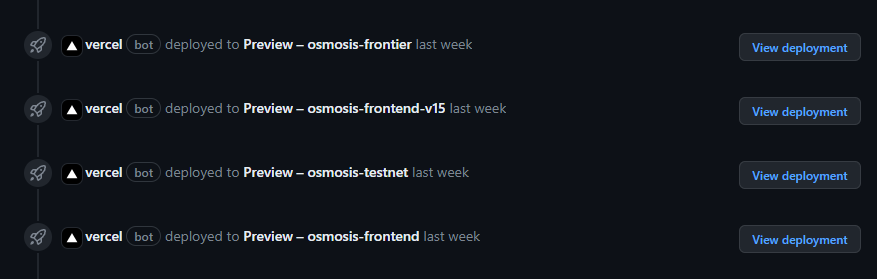
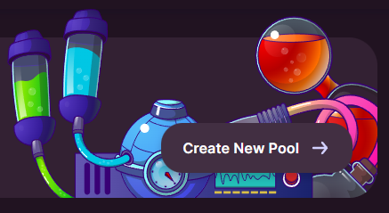

# Create a Pool

The easiest way to create a pool is to draft a pull request on the [Osmosis.zone Frontend repository](https://github.com/osmosis-labs/osmosis-frontend/pulls) as part of the [Registration process](https://docs.osmosis.zone/overview/registration#step-3-register-an-asset-on-the-osmosis-frontend-repository) which will generate a staging link for Osmosis frontier.

This will enable a pool to be created with a more user friendly interface by clicking on the "Create Pool" button.

Recommended parameters for most listings are:
* Weighted pool
* Containing only two Assets
* Paired with OSMO
* 0.2% Swap Fee

Pairings with other base pairs such as ATOM and USDC are recommended to have 0.3% Swap Fees.

Note: Creating a pool on Osmosis costs 100 OSMO which is taken from the address creating the pool. This is transferred to the Osmosis Community Pool.

Listings that are expected to retain a similar or predictable ratio to the paired asset, e.g. Stablecoins or Liquid Staking Tokens, may prefer to use the Stableswap pool instead to increase liquidity efficiency. 

Stableswap pools may assign an address that is able to change the scaling factor to ensure that liquidity optimises around the correct ratio as the value of a Liquid Staked Token changes relative to its unstaked counterpart.

If you wish to create a pool with more advanced settings or before listing then please refer to the [GAMM module documentation](http://localhost:3000/osmosis-core/modules/gamm#create-pool) on how to create a pool using the CLI.