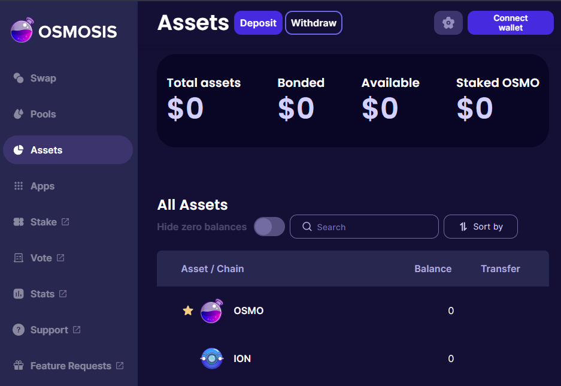

# Ensure Visibility

## List onto the Osmosis Frontend

As long as the asset has been properly registered according to the [registration documentation](https://docs.osmosis.zone/overview/integrate/registration) and there is a pool with USD $1000 of [initial liquidity](https://docs.osmosis.zone/overview/integrate/liquidity) then the pool will be visible on this frontend.

## Verify Assets

An asset will initially show as an Unverified asset. This will require users to toggle on the Unverified Assets setting in the Cog Menu in the top right of their screen to see the asset.

Approval requires meeting the requirements in the assetlist repo that can be seen here: https://github.com/osmosis-labs/assetlists/blob/main/LISTING.md

## Swap Page

Although any asset in a liquidity pool can be traded when a user specifies the pool, an asset will only be listed on the Swap page if it is has a pool containing liquidity of USD $10,000.